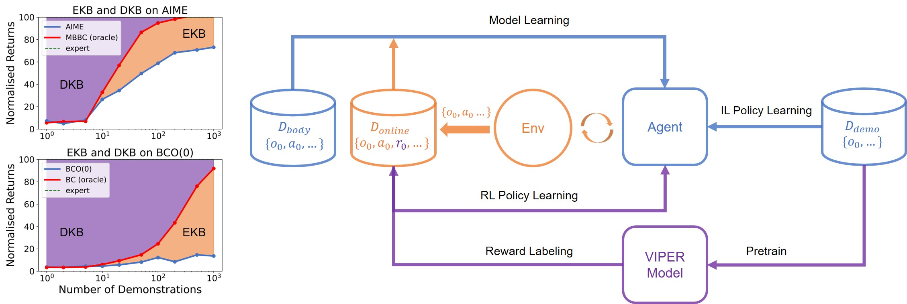

*This repository is published and maintained by the Volkswagen Group Machine Learning Research Lab.*

*Learn more at https://argmax.ai.*

## AIME-v2

This repository contains the original implementation of [AIME-v2](https://arxiv.org/abs/2404.18896) in PyTorch.



If you find this code useful, please reference in your paper:

```BibTeX
@misc{zhang2024overcoming,
    title={Overcoming Knowledge Barriers: Online Imitation Learning from Observation with Pretrained World Models}, 
    author={Xingyuan Zhang and Philip Becker-Ehmck and Patrick van der Smagt and Maximilian Karl},
    year={2024},
    eprint={2404.18896},
    archivePrefix={arXiv},
    primaryClass={cs.LG}
}
```

## Setup

### General

```sh
conda create -n aime-v2 python=3.10
conda activate aime-v2
conda install pytorch==2.0.1 torchvision==0.15.2 torchaudio==2.0.2 pytorch-cuda=11.7 -c pytorch -c nvidia
pip install -r requirements.txt
pip install gdown --upgrade
pip install -e .
```

### Additional setup for [MetaWorld](https://github.com/Farama-Foundation/Metaworld)

```sh
cd ~/.mujoco
wget https://github.com/deepmind/mujoco/releases/download/2.1.0/mujoco210-linux-x86_64.tar.gz
tar -xzvf mujoco210-linux-x86_64.tar.gz
cd <repo_root>
git clone https://github.com/Farama-Foundation/Metaworld && \
  cd Metaworld && \
  git checkout 04be337a12305e393c0caf0cbf5ec7755c7c8feb && \
  git apply ../metaworld.patch && \
  pip install -e . --no-cache-dir
pip install zoopt # if you need to reset the basketball or the box-close environments
```

Then put the below two lines into your `~/.bashrc`:

```sh
export LD_LIBRARY_PATH=$LD_LIBRARY_PATH:~/.mujoco/mujoco210/bin
export LD_LIBRARY_PATH=$LD_LIBRARY_PATH:/usr/lib/nvidia
```

### Docker

If you prefer to use docker, we also provide a Dockerfile. You can build the image by running 

```sh
docker build .
```

## Datesets and Pretrained Models

The datasets and pretrained models can be access from [Github Release](https://github.com/argmax-ai/aime-v2/releases/latest). All the datasets and models are released under a [_CC BY 4.0 license_](https://creativecommons.org/licenses/by/4.0/). For more details, please check out the [Data Card](datasets/readme.md) and [Model Card](pretrained-models/readme.md).

You can use our script `exp_scripts/download.py` to download and extract the files to the correct folder. Please make sure you have `wget` and `zip` installed before running the script.

## Usage

Note: By default, the code will load datasets into RAM for speed. If you encounter OOM error, please consider passing `data.dataset.lazy=True`.

### DMC

All 9 tasks we studied in the paper can be run similarly. I will use the task walker-run as an example here.

#### Getting the Embodiment dataset

You can easily run `python exp_scripts/download.py --name walker-plan2explore-buffer` to download and extract the files to the correct folder.

If you want to generate the embodiment dataset yourself, you need to run the plan2explore agent by

```sh
python train_scripts/train_plan2explore.py env=walker log_name=walker-run-plan2explore
```

Then you can export the dataset to `datasets/` by

```sh
mv logs/walker-run-plan2explore/train_trajectories datasets/walker-plan2explore-buffer
```

#### Getting the Demonstration dataset

First download the `expert_demos.zip` from PatchAIL from [here](https://osf.io/4w69f/?view_only=e29b9dc9ea474d038d533c2245754f0c) and unzip it to `<PatchAIL_root>`.

Then you can export to our data format by 

```sh
python exp_scripts/dataset/convert_patchail_dataset.py -i <PatchAIL_root>/expert_demos/dmc/walker_run/expert_demos.pkl -o datasets/patchail-walker-run-expert
```

#### Pretraining

You need to pretrain both the world model and the VIPER model. You can easily run `python exp_scripts/download.py --name dmc_models` to download and extract the files to the correct folder.


Or you can choose to train the models yourself, which can be done saperately by 

```sh
python train_scripts/train_model_only.py env=walker embodiment_dataset_name=walker-plan2explore-buffer log_name=walker-model-training
```

and 

```sh
python train_scripts/train_model_only.py env=walker embodiment_dataset_name=patchail-walker-run-expert action_free=True epoch=5 log_name=walker-run-viper-training
```

Then you can further export the trained models by 

```sh
python exp_scripts/export_model_from_log.py --log_folder logs/walker-model-training --model_name walker-plan2explore-buffer
```

and 

```sh
python exp_scripts/export_model_from_log.py --log_folder logs/walker-run-viper-training --model_name walker-run-viper
```

#### Running AIME-v2

Finally, you can run AIME-v2 by

```sh
python train_scripts/train_aime-v2.py env=walker env.task=run embodiment_dataset_name=walker-plan2explore-buffer demonstration_dataset_name=patchail-walker-run-expert pretrained_model_name=walker-plan2explore-buffer likelihood_model_name=walker-run-viper
```

### MetaWorld

#### Getting the Embodiment dataset

First, you need to download the `mt80` dataset released by TD-MPC2 from [here](https://huggingface.co/datasets/nicklashansen/tdmpc2/tree/main/mt80) and put them in `<tdmpc2_mt80_root>`. For MetaWorld, we actually only need chunk 11, 12 and 13.

Then, you can run `python exp_scripts/dataset/convert_tdmpc2_metaworld_dataset-mt39.py --root <tdmpc2_mt80_root>` and `python exp_scripts/dataset/convert_tdmpc2_metaworld_dataset-mt50.py --root <tdmpc2_mt80_root>` to get the MW-mt39 and MW-mt50 respectively. 

#### Getting the Demonstration dataset

You can easily run `python exp_scripts/download.py --name metaworld_expert_datasets` to download and extract the files to the correct folder.

To do it yourself, first, you need to download their code and models and run the evaluations. The trajectories will be stored at its log folder `<tdmpc2-logs>`. 

Then you can convert their datasets by

```sh
python exp_scripts/dataset/convert_tdmpc2_metaworld_expert_dataset.py --root <tdmpc2-logs>
```

#### Pretraining

You need to pretrain both the world model and the VIPER model. You can easily run `python exp_scripts/download.py --name metaworld_models` to download and extract the files to the correct folder.

Or you can choose to train the models yourself, which can be done saperately by 

```sh
python train_scripts/train_model_only.py env=metaworld embodiment_dataset_name=tdmpc2-metaworld-mt50 world_model=rssmo-m batch_size=16 horizon=64 log_name=metaworld-mt50-training
```

and 

```sh
python train_scripts/train_model_only.py env=walker embodiment_dataset_name=tdmpc2-metaworld-<task>-expert action_free=True epoch=10 log_name=metaworld-<task>-viper-training
```

Then you can further export the trained models by 

```sh
python exp_scripts/export_model_from_log.py --log_folder logs/metaworld-mt50-training --model_name tdmpc2-metaworld-mt50
```

and 

```sh
python exp_scripts/export_model_from_log.py --log_folder logs/metaworld-<task>-viper-training --model_name tdmpc2-metaworld-<task>-viper
```

#### Running AIME-v2

Finally, you can run AIME-v2 by

```sh
python train_scripts/train_aime-v2.py env=metaworld env.task=<task> embodiment_dataset_name=tdmpc2-metaworld-mt50 demonstration_dataset_name=tdmpc2-metaworld-<task>-expert pretrained_model_name=tdmpc2-metaworld-mt50  likelihood_model_name=tdmpc2-metaworld-<task>-viper world_model=rssmo-m batch_size=16 horizon=64 batch_per_epoch=20
```
